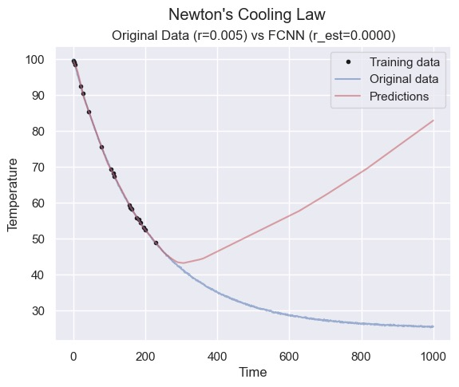
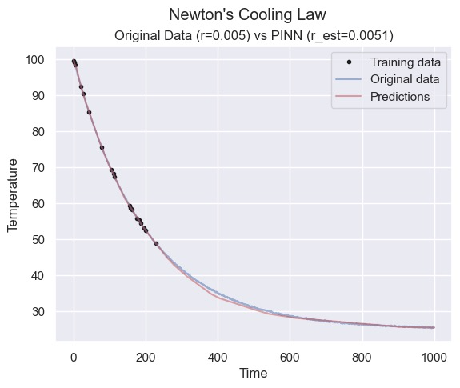
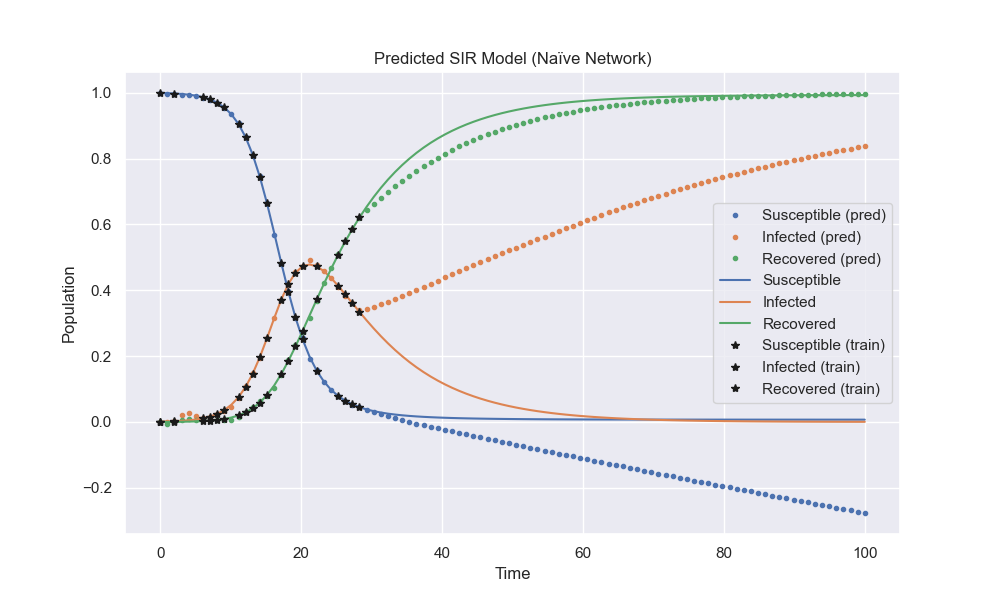
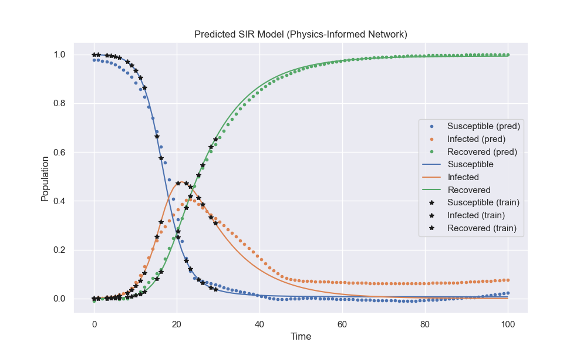

# Exploring Physics-informed Neural Networks For Differential Equations For DS 4440

Yash Bhora and Henry Noyes

Website available at https://expo.baulab.info/2024-Spring/yashrbhora.

## Introduction

The Susceptible-Infectious-Recovered (SIR) model is an epidemiological model used to evaluate and predict the spread of infectious diseases within a population. The model consists of three ordinary differential equations:

The Susceptible Equation: $$\frac{dS}{dt} = \frac{-\beta S(t) I(t)}{{N}}$$

The Infected Equation: $$\frac{dI}{dt} = \frac{\beta S(t) I(t)}{N} - \gamma I(t)$$

The Recovered Equation: $$\frac{dR}{dt} = \gamma I(t)$$

This project aims to apply physics-informed neural networks (PINNs) to the problem of disease spread. PINNs function by introducing prior mathematical constraints as an additional term in the loss equation, restricting the solution space of the network. This helps guide the network to better approximate the behavior of a dynamic system. In the case of disease spread, informing a network with the SIR equations could greatly improve the accuracy of its predictions, especially in the early days of an outbreak when the training data is limited. The accurate prediction of the disease spread can offer insights into the duration of an outbreak, the total number of infections, and the peak of an outbreak. This information is vital for healthcare officials to determine the appropriate allocation of resources during a crisis, which can ultimately save lives.

## Paper Review

Physics-informed Neural Networks by Raussi et al. presents a method of using neural networks to solve differential equations by introducing the mathematical constraints as a regularization agent in the loss function. This prior information serves to shrink the solution space of the network, enabling it to quickly learn a generalized function that obeys the given laws. Generalization is of increased importance in the context of complex biological and physical domains, which are often plagued by low amounts of training data. The authors demonstrate the method by applying PINNs to notable problems such as Schrodingers equation and the Allen-Cahn equation. In these cases, PINNs are able to generate accurate predictions of the non-linear behavior despite the small data sets. The level of performance in these predictions is especially impressive when considering the relative simplicity in the implementation of PINNs.

Though, as the authors recognize, PINNs are not a comprehensive replacement to classical methods. Rather, they offer alternative paths to solving partial differential equations with new features such as parameterization and transfer learning, which can outweigh analytical techniques in specific domains. In our case, we choose to apply PINNs to the SIR model to predict the dynamics of disease spread within a population. PINNs can offer better generalization if the epidemiological data has considerable noise or is sparse. The flexibility of PINNs also allows it to be used in inverse problems, such as estimating model parameters.

## Technical Structure

### Neural Network Architecture

The core of our implementation is a neural network designed to approximate the solutions of the SIR model. The network, implemented using PyTorch, consists of five fully connected layers:

- The first layer takes a single input, representing time *t*, and maps it to 100 neurons.
- The subsequent three layers are hidden layers with 100, 50, and 20 neurons, respectively, each followed by a ReLU activation function to introduce non-linearity.
- The final layer outputs three values corresponding to the susceptible (*S*), infected (*I*), and recovered (*R*) compartments of the SIR model.

Additionally, the model includes parameters *β* and *γ*, representing the infection rate and recovery rate, respectively. These are treated as learnable parameters within the network, allowing the model to adjust these values based on the data.

### Physics-Informed Loss

The key innovation of our approach is the incorporation of the SIR model's differential equations into the loss function. This is achieved through a custom physics-informed loss function that penalizes deviations from the expected dynamics as described by the equations:

- The loss function calculates the derivatives of *S*, *I*, and *R* with respect to time using automatic differentiation.
- It then computes the discrepancies between these derivatives and the expressions given by the SIR model's differential equations.
- Additional terms in the loss function enforce the conservation of the total population and encourage the learnable parameters *β* and *γ* to stay within reasonable bounds.

This physics-informed loss is combined with a traditional mean squared error loss calculated from the training data, allowing the network to learn from both the data and the physics of the problem.

### Training and Evaluation

The model is trained using the Adam optimizer, with a learning rate scheduler to reduce the learning rate when the validation loss plateaus. The training process involves:

1. Minimizing the combined physics-informed and data-driven loss.
2. Regularly evaluating the model on a validation set to monitor its performance and adjust the learning rate as necessary.
3. Saving the model parameters that achieve the lowest validation loss, ensuring that the best-performing model is retained.

After training, the model's predictions for the SIR curves are compared against the actual data to assess its accuracy and generalization capability.

[Click here](https://github.com/yashrbhora/exploring-PINNs-for-diffeq/blob/main/sir_basic_PINN.ipynb) to view the notebook on GitHub.

## Results

First, to verify our architecture, we applied PINNs to a simple differential equation: Newton's Cooling Law. This equation is described by: $$\frac{dT}{dt} = R (T_{env} - T)$$ where $R$ is the cooling rate, $T_{env}$ is the temparature of the environment, and $T$ is the temperature of the object. As seen in the plots below, the addition of the physics loss term dramatically improves the predictive accuracy of the neural network in the time domain past training data.

   

Next, we trained a simple neural network to model the SIR equations. This network has no prior knowledge of the dynamics of the system and is purely minimizing the mean square error loss from the training data. As shown below, this network fails to generalize well to the future behavior of the SIR model, generating a solution which describes a negative susceptible population.

Then, we used the same neural network architecture, but incorportated the physics-informed loss in the optimization. As shown below, the nerual network with the same architecture peforms much better in its predictions of the SIR model. This demonstrates the value in providing the prior mathematical knowledge from the system of differential equations. In the event of strong noise or low amounts of training data, the addition of a physics-informed loss term can lead a neural network to estimate much more practical solutions that fit the constraints of the problem domain.

## Conclusion

As shown above, the application of PINNs to disease spread using the SIR equations generates substantial improvements over basic neural network architectures. By informing the loss function with prior information about the system, the model is able to better generalize to the long-term behavior of the disease spread. The increased accuracy in modeling these equations can provide policymakers with valuable knowledge about the future state of the population. In the future, this work could be further progressed by applying PINNs to more complicated epidemiological equations such as the SEIR or SEIRS models.

## References

[1] [M. Raissi, P. Perdikaris, and G.E. Karniadakis. *Physics-informed neural networks: A deep learning framework for solving forward and inverse problems involving nonlinear partial differential equations.*](https://www.sciencedirect.com/science/article/pii/S0021999118307125) Journal of Computational Physics, vol. 378, pp. 686-707, February 2019.
